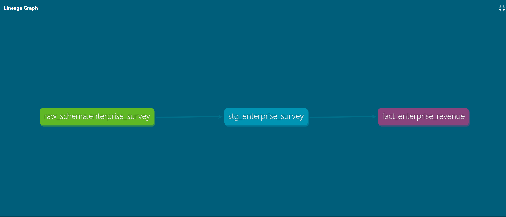
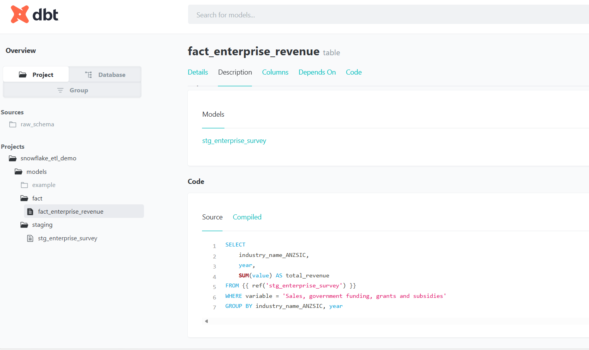
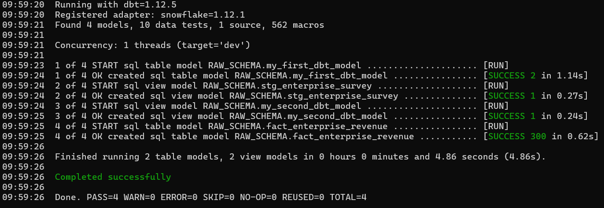
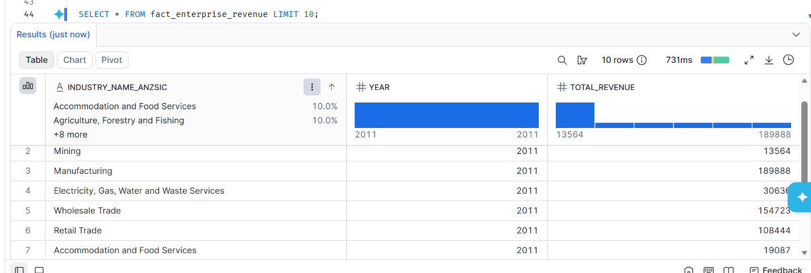

# Snowflake ETL dbt Demo

## 📌 Overview
This project demonstrates an end-to-end ETL pipeline:
- **Python** loads raw CSV data into **Snowflake**
- **dbt sources** define raw tables
- **dbt staging models** clean and cast data
- **dbt fact models** aggregate metrics (e.g., revenue by industry/year)
- **dbt tests** validate data quality
- **dbt docs** generate lineage graphs and documentation

## 🛠 Tech Stack
- Python  
- Snowflake  
- dbt (Data Build Tool)

## 🚀 How to Run
1. Clone this repository:
   ```bash
   git clone https://github.com/pkna162q/snowflake-etl-dbt-demo.git

1. Project Overview
“This project demonstrates an end‑to‑end ETL pipeline using dbt with Snowflake. Raw survey data is ingested into Snowflake, transformed through staging models, and aggregated into fact tables for analysis.”

2. Lineage Graph
“The lineage graph shows the flow of data from the raw source table (enterprise_survey) into the staging model (stg_enterprise_survey), and finally into the fact model (fact_enterprise_revenue). This highlights dbt’s ability to manage dependencies and ensure reproducible transformations.”

3. Staging Model
“The staging layer standardizes raw data by casting types, renaming columns, and preparing clean inputs for downstream models. This ensures consistency and simplifies fact table logic.”

4. Fact Model
“The fact model aggregates enterprise survey data by year, industry, and size group. Documentation and column‑level tests are defined in schema.yml, ensuring data quality and transparency.”

5. dbt Run Output
“The pipeline was executed successfully, with all models compiled and materialized in Snowflake. The run output confirms that both staging and fact models were built without errors.”

6. Snowflake Table Preview
“The final fact table (FACT_ENTERPRISE_REVENUE) is available in Snowflake for analysis. A preview query demonstrates the transformed data ready for reporting.”

7. Tests & Documentation
“dbt tests validate critical fields such as year, industry_name_ANZSIC, and value to ensure completeness. Documentation in dbt docs provides clear metadata for each model and column.”   

   ## 📸 Project Screenshots

### Lineage Graph


### Fact Model Details


### Staging Model Details


### dbt Run Output


### Snowflake Fact Table Preview


